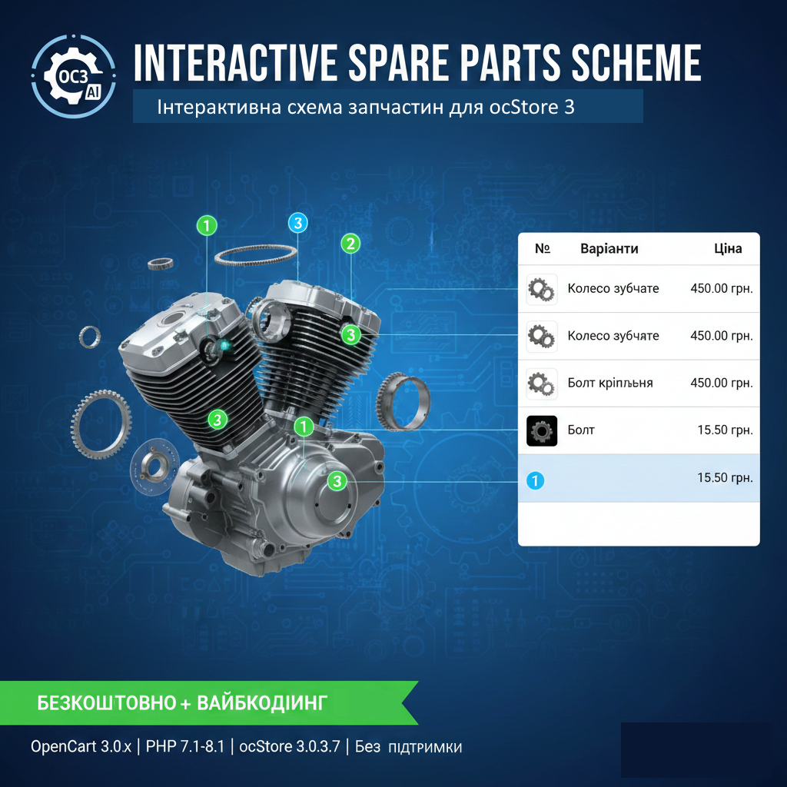

# [OC3] Interactive Spare Parts Scheme



Інтерактивна схема запчастин для **OpenCart 3.0** та **ocStore 3.0**. Модифікатор дозволяє створювати візуальні схеми підбору запчастин на основі будь-якого зображення.

> **💡 Note:** Цей проект було "вайбкоджено" — створено за допомогою ШІ з мінімальною ручною адаптацією. Код відкритий для покращень спільнотою.

## ✨ Особливості
- **Інтеграція в картку товару:** Додає вкладку "Схема запчастин" в адмінці для кожного товару (окремої сторінки налаштувань немає).
- **Швидке додавання:** Можливість вибрати існуючий товар через автокомпліт або створити новий прямо на схемі.
- **Розумна навігація:** Клік по номеру на схемі плавно переміщує користувача до потрібного рядка в таблиці.
- **Контроль кількості:** Вбудована перевірка залишків (клієнт не може купити більше, ніж є в наявності).
- **Гнучкий дизайн:** Налаштування кольорів та розмірів точок окремо для ПК та мобільних пристроїв.
- **Авто-категорія:** Вибір категорії, куди зберігатимуться нові "власні" товари.
- **Очищення кошика:** Автоматичне очищення кошика після успішного замовлення.

## ⚙️ Технічні вимоги
- **CMS:** OpenCart 3.0.x / ocStore 3.0.x
- **PHP:** 7.1 - 8.1
- **MySQL:** 5.6+
- **Тема:** Default (для кастомних тем потрібна адаптація CSS/JS)

## 🚀 Установка
1. **База даних:** Виконайте наступний SQL-запит у вашій БД (наприклад, через phpMyAdmin), враховуючи ваш префікс таблиць (за замовчуванням `oc_`):
   ```sql
   CREATE TABLE IF NOT EXISTS `oc_product_scheme` (
     `product_id` int(11) NOT NULL,
     `image` varchar(255) DEFAULT NULL,
     `scheme_data` longtext DEFAULT NULL,
     `replace_main` tinyint(1) DEFAULT '0',
     PRIMARY KEY (`product_id`)
   ) ENGINE=MyISAM DEFAULT CHARSET=utf8;

   Модифікатор: Завантажте файл install.xml через меню Extensions > Extension Installer.

    Оновлення: Перейдіть у Extensions > Modifications та натисніть кнопку Refresh.

    Використання: Відкрийте будь-який товар в адмінці, перейдіть у нову вкладку "Схема запчастин" та завантажте зображення схеми.

🤝 Підтримка та внесок

    Статус: Безкоштовно (Open Source).

    Підтримка: Офіційна підтримка відсутня. Проект надається "як є".

    Спільнота: Будемо вдячні за Pull Requests та покращення коду (наприклад, перетворення на повноцінний модуль).

Автор: Mhack & AI

Профіль: [OpenCartForum](https://opencartforum.com/profile/980825-mhack/)
